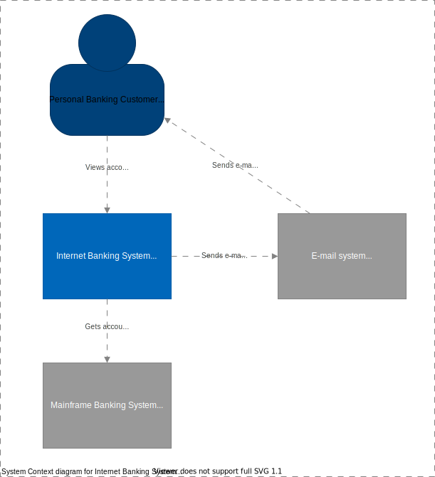

# C4-hacks

Experiments with the [C4 model](https://c4model.com/).

## System Context

The bank customer uses the Internet Banking System to view account balances and
to make payments.

## Internet Banking Containers

The Internet Banking System is described in more detail in the 
[Container Diagram](src/README.md).

