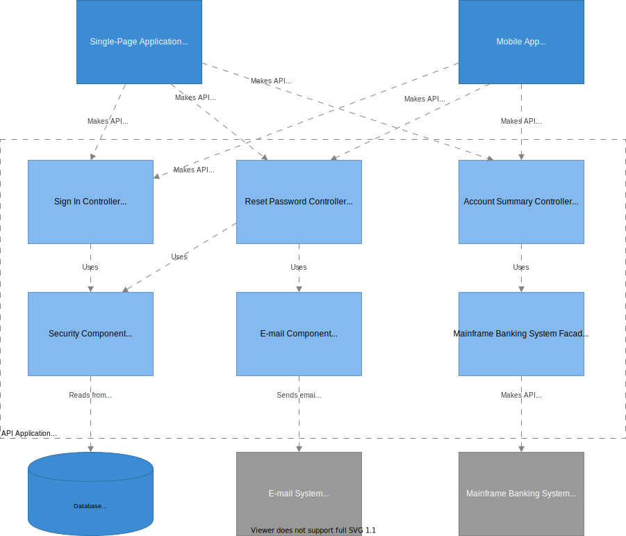

# Internet Banking API Application

Provides Internet banking functionality to via a JSON/HTTPS API.

## Components

### E-Mail component

* [Email](email)

### Controllers

The API application has the following main [controllers](controllers):

*   Accounts Summary
*   Password
*   Sign in

### Security

The security is provided by the [security](security) library.
